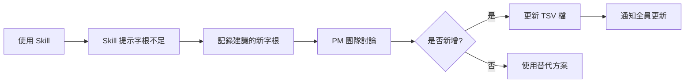

# 元件命名 Skill 使用教學

> 📌 最後更新: 2025-02-15  
> 👤 維護者: [你的名字]

---

## 🎯 這是什麼?

元件命名 Skill 是一個 AI 輔助工具,幫助我們根據團隊的**字根字首規範**快速且正確地為 APP 元件命名。

### 解決的問題
- ❌ 命名不一致,難以維護
- ❌ 新人不熟悉命名規則
- ❌ 討論命名耗費時間
- ❌ 容易違反順序或唯一性規則

### 帶來的價值
- ✅ 3 分鐘內獲得符合規範的命名
- ✅ 自動驗證命名正確性
- ✅ 降低新人學習門檻
- ✅ 支援字根字首表擴充建議

---

## 📂 檔案位置

### Google Drive (或其他共享位置)
```
📁 產品文檔
  └─ 📁 元件命名 Skill
      ├─ 📄 SKILL.md (主檔案)
      ├─ 📄 PAGEs_字典_-_字根字首表.tsv (字根表)
      ├─ 📄 README.md (完整說明)
      └─ 📄 quick-start-guide.md (快速指南)
```

🔗 [點此前往 Google Drive](你的連結)

---

## 🚀 5 分鐘上手

### 1️⃣ 下載檔案
從上方連結下載 `SKILL.md` 和 `PAGEs_字典_-_字根字首表.tsv`

### 2️⃣ 開啟 Claude
- 網頁版: https://claude.ai
- 桌面版: Claude App

### 3️⃣ 上傳檔案
拖曳兩個檔案到對話框,或點擊 📎 上傳

### 4️⃣ 啟動 Skill
```
我要使用元件命名 skill
```

### 5️⃣ 描述元件
```
我需要一個[容器類型]用來[功能描述]
```

---

## 💼 實際使用案例

### 案例 1: PM 設計新功能

**情境**: Sarah 負責設計「投資組合分析」功能,需要命名多個元件

**操作**:
```
我需要命名以下元件:
1. 顯示投資組合整體績效的卡片
2. 可以篩選不同時間區間的導覽列
3. 展示各標的分布的圓餅圖
```

**結果**: 3 分鐘內獲得所有命名建議,直接用於設計文檔

---

### 案例 2: 開發者確認命名

**情境**: David 實作功能時發現設計稿上的元件名稱看起來怪怪的

**操作**:
```
檢查這個命名是否正確: Search_Container_PersonalSelection
```

**結果**: 發現順序錯誤,應該是 `Container_PersonalSelection_Search`

---

### 案例 3: 新人學習規範

**情境**: Amy 剛加入團隊,不熟悉命名規則

**操作**:
```
解析這個元件名稱: Card_IndividualStock_Quote_Filter
```

**結果**: 理解每個部分的含義和分類,快速學習命名邏輯

---

## 📊 命名規則總覽

### 核心規則

| 規則 | 說明 | 範例 |
|------|------|------|
| 順序規則 | 前綴 → 大類別 → 子類別 → 功能 → 詳細描述 | `Card_IndividualStock_Quote` ✅ |
| 唯一性 | 每個分類最多出現一次 | `Container_Filter_Search` ❌ |
| 同層可重複 | 同一層級可多個字根 | `Card_IndividualStock_News` ✅ |
| 底線連接 | 使用 `_` 連接 | `NavBar_PersonalSelection` ✅ |

### 分類說明

| 分類 | 用途 | 常見字根 |
|------|------|---------|
| **前綴** | 元件的結構/容器類型 | Card, NavBar, Table, List, Button, Page |
| **大類別** | 元件的功能領域/業務範疇 | IndividualStock, Market, Acount, Info, Strategy |
| **子類別** | 更細緻的資料類型/狀態 | Quote, Trend, News, PriceChange, BasicInfo |
| **功能** | 元件的操作行為 | Filter, Edit, Search, Collapse, Delete, Add |
| **詳細描述** | 特定的業務對象/版本 | US4, Twa00, InternationalIndex |

---

## 🔄 字根字首表更新流程

當遇到現有字根無法表達的概念時:



**負責人**: [字根字首表維護者名稱]  
**更新頻率**: 每月第一週五統一更新

---

## ⚠️ 注意事項

1. **永遠先載入字根字首表**: 沒有表格,Skill 無法提供準確建議
2. **使用最新版本**: 定期檢查是否有更新版本
3. **人工複查**: Skill 的建議仍需團隊成員判斷業務適用性
4. **記錄異常**: 如果 Skill 建議不合理,請回報給維護者

---

## 📈 使用統計 (可選)

| 月份 | 使用次數 | 命名準確率 | 節省時間 |
|------|---------|-----------|---------|
| 2025-02 | - | - | - |
| 2025-03 | - | - | - |

---

## 💬 問題回報與建議

- **Slack 頻道**: #product-tools
- **Email**: [維護者 Email]
- **改進建議**: 歡迎隨時提出!

---

## 📚 延伸資源

- [完整 README](連結) - 詳細使用說明
- [字根字首表完整版](連結) - 所有可用字根
- [命名規範文檔](連結) - 團隊命名原則

---

> 💡 **小提示**: 把 SKILL.md 和字根字首表存在電腦的固定資料夾,使用時直接拖曳上傳更快速!
